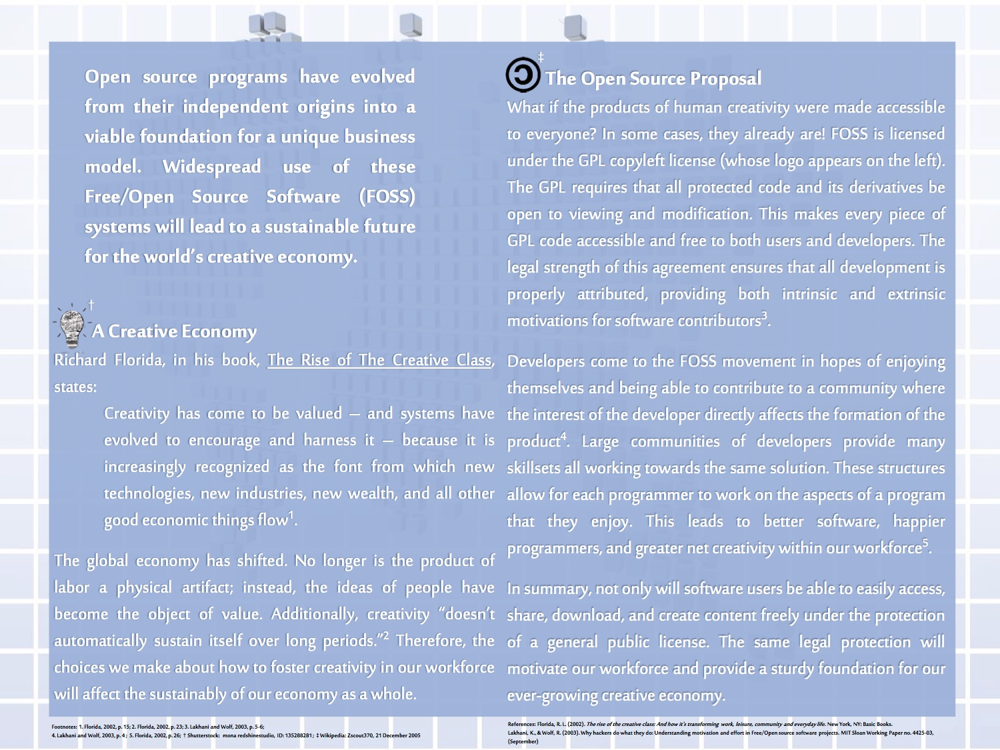

These presentations were an assignment for **HCDE 231 Introduction to Technical Communication.** The goal of this course was to “examine[] fundamentals of research and presenting technical information for various audiences and purposes. Individually and in teams, students learn to construct documents and presentations, following conventions of oral, written, and visual communication. Assignments are framed around ethical and sustainable engineering practices.”

I chose to focus my assignments around the “ethical and sustainable” practices of Open Source Programming – developing a presentation and poster to go along with it. The final presentation is available here:

[Assignment-4-Ethics-Presentation.pdf](/docs/Assignment-4-Ethics-Presentation.pdf)

My original poster was designed to be presented in a conference setting:

Poster - Rough Draft

---

In response to this assumption and my chosen design, my instructor gave the following feedback:
- Your introduction has some of the good storytelling I was talking about in class, but it should go a bit further and talk about the connection between creativity and Open Source.  Then, you should establish your purpose for the poster and overview the rest of its contents. A good introduction that has all of these elements will tie your entire poster together.
- Introduce your bulleted lists before you include them so that your readers have more context. For example, your bulleted lists under Open Source Solution — is this the way it is now or the way it should be?
- Include more background information — what is open source and why is it so important?  An example of some popular  open source software would be a great topic to include.
- Provide a detailed discussion of recommendations/approaches that have been taken toward resolving the sustainability issue or problem.

 
Design wise:
- Make a bigger deal of your title. Right now, you’ve got two titles at the top of your poster and I can’t really tell which is the main poster title. 
- Label all figures at the bottom.  Maybe include some data regarding the number of open source programs in mainstream use?  Something to illustrate what a big issue this is.  When you include figures, also tell people when you want them to look at them.
- Focus on the design principles we talked about, especially proximity, alignment, and queuing.  Set sections off somehow using white space or shaded boxes. Align paragraphs horizontally and vertically.  Use queuing techniques, such as numbers or arrows, to indicate in what order readers should go through your poster.

In response to these critiques, I generated a final design which better fit the theme of my presentation:

[PDF Version](/docs/Assignment-3-Sustainability-Poster-Redone.pdf)

