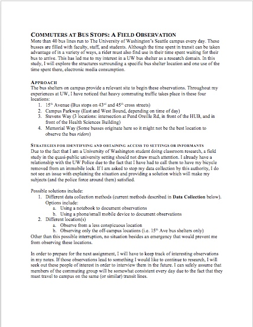
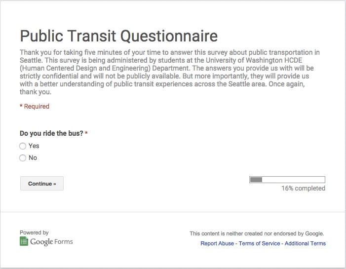
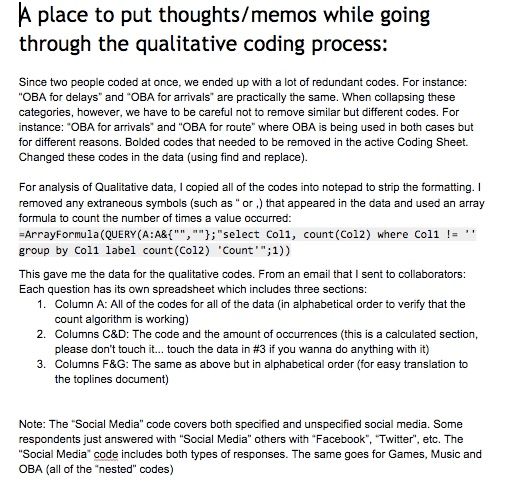
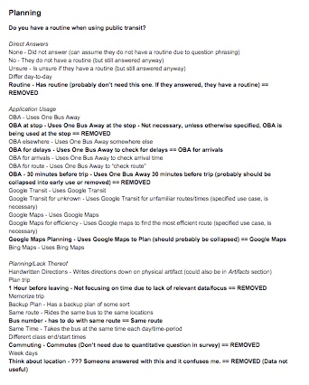
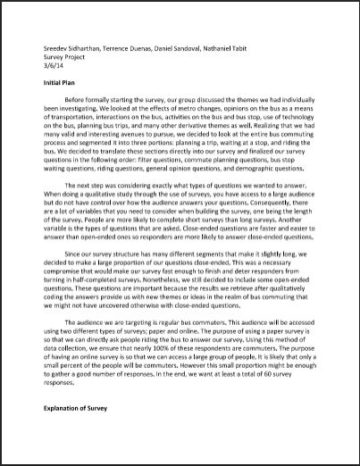

This research report was an assignment for **HCDE 313: Introduction to User Research, Winter 2014**. The goals of this course were to:

*   Understand how user research applies to engineering contexts
*   Identify a range of user research methods and the associated instruments
*   Ask the right questions to determine which kind of user research is best suited to different circumstances, including scope and timeline of a study
*   Create user research instruments

During this course, I produced a number of deliverables that demonstrate my user research methods. I chose to focus on the domain of Public Transportation as it was of interest to me at the time. Over time, the project developed a focus on commuter habits while waiting for the bus. The research report includes observational, interview and survey data that I collected over an 8-week period.

The final assignment, **Communicating User Research Results** was developed to demonstrate my ability to synthesize multiple sources of primary research and provide recommendations to a selected stakeholder. It is available to view at the link below:

[http://1drv.ms/1EDX0QS](http://1drv.ms/1EDX0QS)

---

# 1st Deliverable: Field Observation

For this assignment, you will choose a field site, create a plan for researching it, gain access to it, conduct a couple of field studies, and turn in a report on your field studies. You can conduct participant-observation, shadow participants as they perform tasks, or just observe a setting in detail, depending on the nature of your domain choice.

Start by writing an initial plan for how you will gain access to the site and what kinds of things you will be looking for. This plan will be part of the final assignment you hand in. This is also an opportunity to begin articulating the thoughts or unexplained assumptions in your mind; getting these on paper will help you identify potential barriers or choke points in your plan.

Your **initial plan** should cover these things:

1.  **Strategies for identifying and obtaining access to settings or informants**. Discuss your pre-existing relationships or other strategies you will use. How many conversations do you think you’ll need to have? With whom? Will these require scheduling meetings or can you just show up or call?
2.  **Timeline for research studies.** When will you do your observations? How long do you think each will take, including travel time? When will you write up your field notes?
3.  **Data collection methods you will use**. How will you record notes? In a notebook? On a computer? What approaches will you use to participate/observe in the site?

When you have a plan ready and have negotiated access (if applicable), go to your study site at least three (3) times, each for approximately 30-45 minutes over the course of the next two weeks. As you are in the field, take detailed notes about what you observe, reflections about your participation or observations/interpretations, thoughts about what people are doing and how they are interacting with the objects around them. Sometimes in participant-observation work, it is very difficult to take notes while an event is occurring (such as participating in a sporting event or a videogame), so be sure to write notes and reflections as soon as possible after each field study session.

[Click here to view the document](http://1drv.ms/1JG4Vex)

_I consolidated the initial plan, data collection and observational report in a single document: [http://1drv.ms/1HFtUQg](http://1drv.ms/1HFtUQg "Fieldwork Assignment") (>150mb due to Appendices – recommended to download and open with MS Word)_

# 2nd Deliverable: Field Observation

This assignment is designed to help you learn to be a better interviewer, and analyzer of interview data. Over the next two weeks, you will conduct four interviews with people in the general domain that you selected for your field observation assignment. As a result of that assignment, you will have gained initial insight into the environment, especially across two themes: first, the structure and authority associated with the space or organization, and second is the other theme you selected to write up in your paper. These themes will raise issues and questions about which you can learn more through a focused interview process with stakeholders or others who are familiar with the research site.

Your goal with this assignment is to drill down on questions that arose from the analysis of your fieldnotes in the previous assignment. You will identify those questions, build an interview script designed to elicit more information that can answer those questions more comprehensively than observation alone, you will transcribe at least *one* of those interviews, and you will analyze the data from all of the interviews.

[Click here to view the document](http://1drv.ms/1OqONEc)

# 3rd Deliverable: Survey Results

The survey assignment builds on your previous assignments. Unlike the field observation or interview assignments, however, this is a group assignment.

**_The goal of this assignment is for you to learn how to design, administer, and analyze a survey._**

We will help you arrange yourselves into 3-4 person groups that are (at least lightly) thematically tied. Each group will develop, administer and report on the results of a survey that is designed to answer specific questions. The questions will be tied to the domain where you have been doing your research thus far during the quarter, and they should build on the themes you have collectively addressed in your field observations and interview assignments.

The survey must include each of the following question types. How many of each question you include depends on the kind of survey you are writing and what you want to learn:

*   Open-ended questions
*   Close-ended questions with ordered response categories (other than Likert scale)
*   Close-ended questions with a Likert scale
*   Close-ended unordered questions

How long should the survey be? Long enough to generate good information, short enough to not frustrate people to cause them to stop answering the questions.

The group will be expected to pilot test the survey with at least two people (it can be classmates!), document the results of that pilot test, revise the survey in response to the pilot test, and then administer the revised instrument to at least 50 people. The survey can be administered online or in person, but your group will have to explain and justify the choice of method.

Other requirements for the survey:

*   Generate a sampling plan
*   Generate a stratified sample strategy
*   Measure the response rate to the surveys (insomuch as it is possible given your administration approach)

[Click here to view the document](https://docs.google.com/forms/d/1GJcDFe3gIX7q5wvdPdcZsIoVwGRFG47W97NymqjJ04M/viewform)

Together with a group of 3 other students, I generated the survey shown above (click the image to access the live survey). The generation of questions and survey format was a group effort while the analysis was done individually. While navigating through the [collected responses](https://docs.google.com/spreadsheets/d/1_xY4NdWqhr9redOFWsrAzJ02ae2tl6VBYhZhB5vRduM/edit?usp=sharing) (links to the raw data), I generated the following documents:

[Click here to view the document](https://docs.google.com/document/d/1zp2glv6nCPwk5LdczqFQhwjS9gVgV0C8m3JdSrXEm8A/edit?usp=sharing)

[Click here to view the document](https://docs.google.com/document/d/1P34JPeIliE4ZptI1xuPRB9FRG4pHK-JKkDIE7Jy50-k/edit?usp=sharing)

The group collaborated to code the collected qualitative data and visualize the various collected quantitative measures. Together, we came up with the following document which includes a copy of the survey and its top lines:

[Click here to view the document](https://drive.google.com/file/d/0B3BoCDEl2M27ZmREbjJTN0xaVXM/view?usp=sharing)

# Final Deliverable: Communicating Research Results

Define your stakeholder(s). Write a detailed paragraph of who you are preparing the information for and the uses that you think they will have for the information. Obviously, for most of you this is a thought experiment, although some of you have made close contact with stakeholders interested in your project. In your paragraph, please specify what elements are based on real relationships you have with stakeholders and which are speculative.

Think about what these stakeholders design. Is it a product? A policy? A space? More than one of these? Articulate the ‘design space’ and then begin to think about the users you researched.

What have you learned about those users that is most important for your stakeholders’ work? From this, you will create a summary of the target user population that synthesizes findings and analyzes your data. In addition to this user profile, you will then extract opportunities for how to design for the population.

[Click here to view the document](http://1drv.ms/1IYm1nF)

